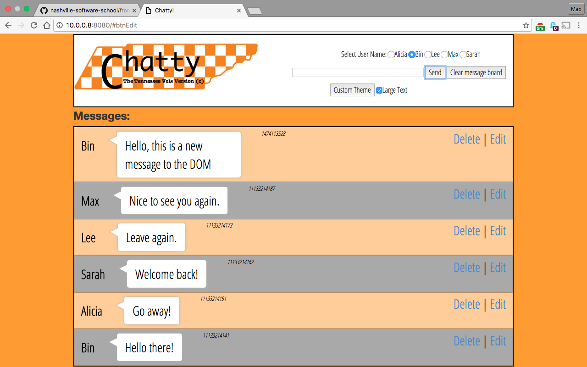
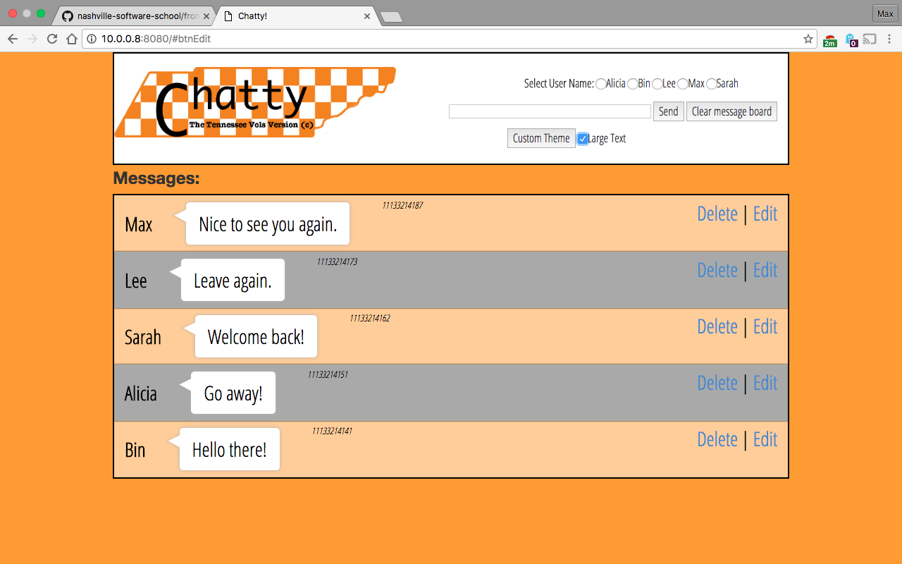
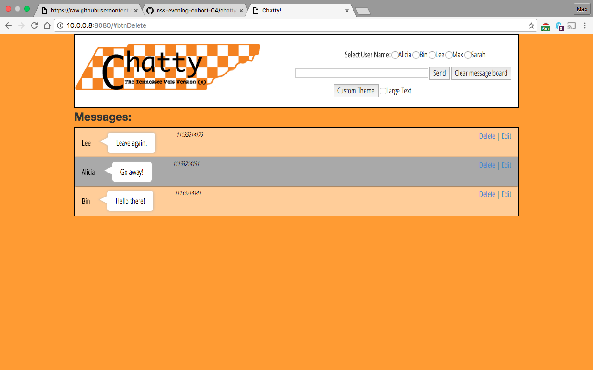
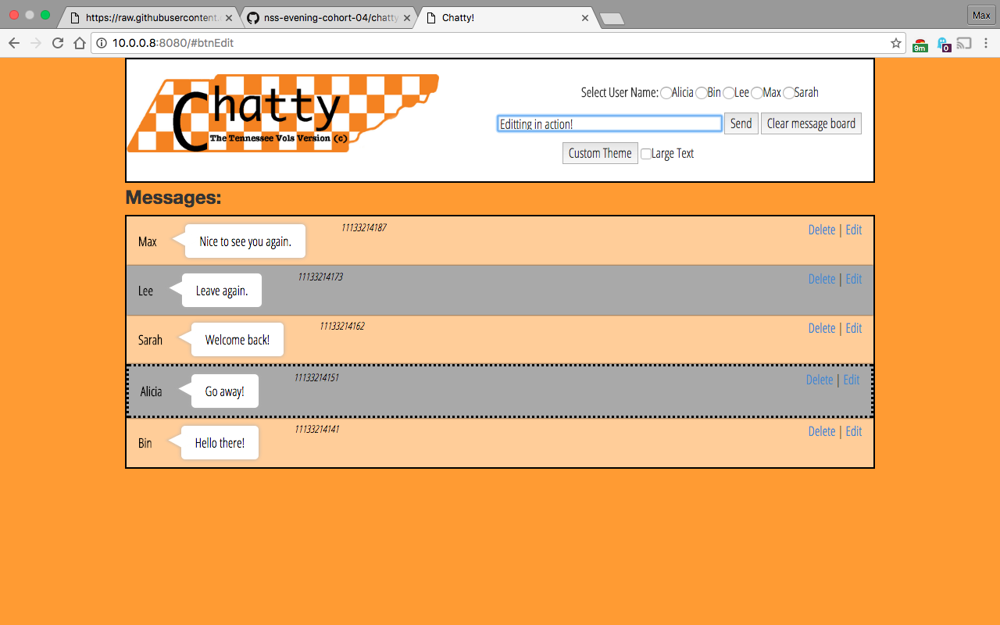
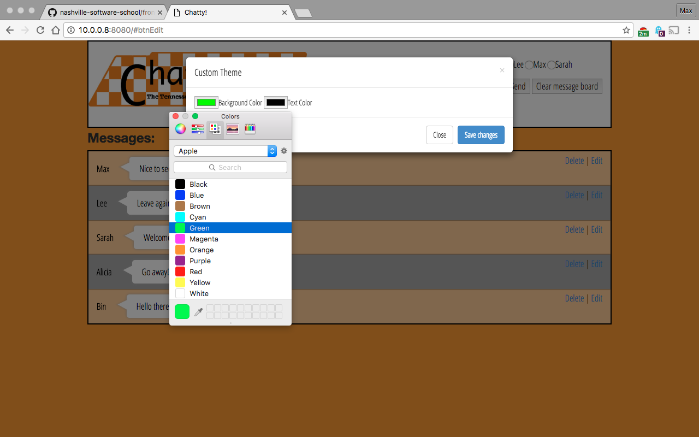
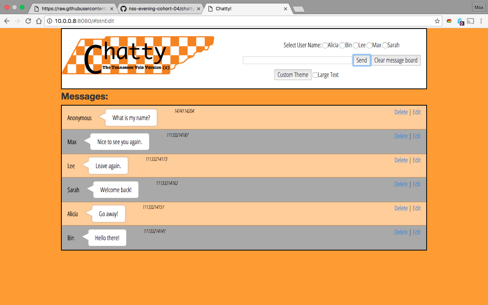
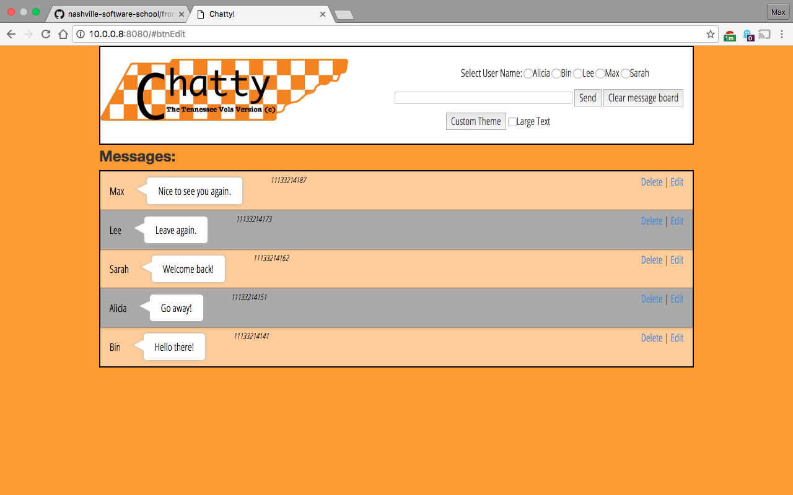

# Contributors
* [Lee Hankins](https://github.com/utleroy)
* [Bin Li](https://github.com/LibE4)
* [Alicia Miceli](https://github.com/aliciamiceli)
* [Sarah Ward](https://github.com/sward42)

#### Product Tester
* [Max Baldwin](https://github.com/maxbaldwin)

##### Basic Premise
Evening-Cohort 4 was split among groups to create a basic single-page chatroom. 
The chatroom was to have the following requirements fufilled in order to be completed. 

## Requirements
### Navigation bar

1. Create an element to serve as the navigation bar for your application.
1. Create an element to hold the logo for your application. It can be as simple as text, but if you want to find an image, that's fine.
1. Create a input field for a user to enter in a message.

1. Add an event listener for "keypress" and detect when then return key has been pressed in the message field.
1. When return key is detected, you'll create a new message (*see details below*).
1. Create a button to clear all messages.
1. When the user clicks the clear messages button, all current chat messages should be removed from the application.
1. If there are no messages, then the clear messages button should be disabled (*see example above*).
1. The navigation bar should remain at the top of the screen, even if the contents of the page start to scroll.
#### The tasks about clearing messages are handled below in main.js
```
// Handle the click event on clear button
btnClearEmt.addEventListener("click", function(){
  outputEmt.innerHTML = "";
  Chatty.removeMsg();
  // disable clear button when no message appear
  if (Chatty.getMsg().length === 0){
    btnClearEmt.setAttribute("disabled", true);
  }
});
```

### Options

1. Create two checkboxes below the message input field. One labeled "Dark theme" and the other labeled "Large text".

1. When the user clicks on the dark theme checkbox, change the background color of your application to a dark gray, and the font color for messages should be white(ish)... you pick.
1. If the user unchecks the box, the background color should change back to white with black text for messages.

### Messages
1. When the page is first loaded, you must load 5 messages from a local JSON file and pre-fill a message area `<div>` below the input field that will also hold all new messages as they get created.
1. When the user presses the return key in the message field, the new message should be inserted into the message area.
1. The message should have a button displayed after it with the text "Delete" inside of it.
1. When the delete button next to a message is clicked, only that message should be removed from the DOM.



### Modular Code

Create multiple IIFEs, following the Single Responsibility Principle, that perform the following functions. The name of your global variable that gets augmented by the IIFEs should be `Chatty`.

1. One IIFE should load the JSON file and returns the array of objects.
1. One IIFE should contain a function that accepts an element `id`, and the user message, and then add the user's message - along with the delete button - to the specified parent element. Each message should be stored in a private array in this IIFE. This IIFE should also expose a function to read all messages, and delete a single message.
1. One IIFE should accept a message element `id` and then remove the correct element from the DOM. This IIFE should also remove the corresponding message from the private array that was created in the previous IIFE.

## Bonus criteria
##### Bonus items were addressed by the team as well. Those items are described below. 

### Multiple JSON files

##### "message1.json"
```
{
  "messages":[
    {
      "name": "Bin",
      "time": "11133214141",
      "userMessage":"Hello there!"
    },
    {
      "name": "Alicia",
      "time": "11133214151",
      "userMessage":"Go away!"
    }
  ]
}
```
##### "message2.json"
```
{
  "messages":[
    {
      "name": "Sarah",
      "time": "11133214162",
      "userMessage":"Welcome back!"
    },
    {
      "name": "Lee",
      "time": "11133214173",
      "userMessage":"Leave again."
    },
    {
      "name": "Max",
      "time": "11133214187",
      "userMessage":"Nice to see you again."
    }
  ]
}
```

#### Instead of having one JSON file with five messages in it, break each message into its own JSON file. How do you handle loading them in succession?
See "main.js" to where this was addressed.
```
Chatty.getJson("message1.json", msgToDOM);
Chatty.getJson("message2.json", msgToDOM);
function msgToDOM(dataObj){
  for (var i = 0; i < dataObj.messages.length; i++){
    Chatty.setMsgInDOM(dataObj.messages[i]);
  }
  btnEmt.removeAttribute("disabled");
}
```

### Editing

1. Let users edit an existing message. Add an edit button next to the delete button that, when clicked, will take the message and put it back in the message input at the top.
1. Once user edits the message and presses the return key again, the message text in the list should be updated.


### Custom themes

1. Add a button/link to the UI labeled "Change Theme".
1. Remove the existing elements for changing the theme.
1. When user click on Change Theme element, show a Bootstrap modal dialog box.
1. Inside the modal, show two color picker fields - one for background color and one for font color.
1. Add a *Save* and *Cancel* button to modal.
1. When user clicks *Save* apply the chosen colors.


### Multiple users

1. Create an object in your JavaScript that holds an array of names.
1. Next to the message input box, there should be a radio button group for each name in the list.
1. When a user enters a message, it should be prepended with the chosen user's name, in bold text.
1. Keep in mind that this will likely change the structure of your JSON file since the pre-loaded messages have to have this information on them.

###### If not user is selected a 'Anonymous' username is given. 


##### HTML of where the users are
```
    <div id="user-select">
    <label >Select UserName:</label>
    <input type="radio" name="user" value="Alicia">Alicia
    <input type="radio" name="user" value="Bin">Bin
    <input type="radio" name="user" value="Lee">Lee
    <input type="radio" name="user" value="Max">Max
    <input type="radio" name="user" value="Sarah">Sarah
    </div>
```

### Message limit

1. Only show the last 20 messages.

##### See code below where the 20 message limit is used. 

```
    var msgHTML = "";
    for (var i = msgCollection.length-1; i >= Math.max(msgCollection.length - 20, 0); i--){
      msgHTML += `<div id="msg-${i}" class="message1234">`;
        msgHTML += `<div class="name">${msgCollection[i].name}</div>`;
        msgHTML += `<div class="time">${msgCollection[i].time}</div>`;
        msgHTML += `<div class="message">${msgCollection[i].userMessage}</div>`;
        msgHTML += `<button class="btnDelete" id="btn-${i}">Delete</button>`;
        msgHTML += `<button class="btnEdit" id="btnEdit-${i}">Edit</button>`;
      msgHTML += `</div>`;
    }
    document.getElementById("messageOutput").innerHTML = msgHTML;
  }
```

### Timestamp

1. Put a timestamp on each message.
1. Again, this will change the structure of your JSON file.

# Completed Project Image
